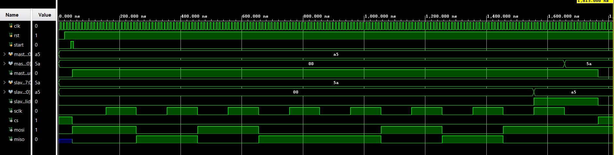

# RTL SPI Controller (Master & Slave)


## 📌 Overview

This project implements a **fully synthesizable, full-duplex SPI (Serial Peripheral Interface) Controller** using pure Verilog. 
The design includes both a **Master** and a **Slave** module operating in **SPI Mode 0** (CPOL=0, CPHA=0), designed for reliable high-speed inter-chip communication.

Unlike simple shift-register implementations, this core features robust **Finite State Machine (FSM)** control, dedicated buffer separation to prevent data corruption, and precise timing control using a configurable clock divider.

All simulation waveforms and test results are provided in the **images/** directory.

---

## ✨ Features

### ✔ Robust Master Architecture
* **Configurable Speed:** Parametric `CLK_DIV` allows easy adjustment of the SPI `sclk` frequency.
* **Data Integrity:** Implements **separate TX and RX shift registers** to prevent LSB overwrites during simultaneous read/write operations.
* **Clean Timing:** dedicated "Cleanup" state ensures Chip Select (`CS`) is held low for the correct duration before termination.

### ✔ Resilient Slave Architecture
* **Asynchronous Reset:** Includes active-low reset (`rst`) for deterministic startup states.
* **Precise Indexing:** Fixed bit-indexing logic ensures no bits are skipped during transmission.
* **Pre-load Capability:** Data is latched into the transmission buffer immediately on the falling edge of `CS`.

### ✔ Protocol Compliance
* **Mode 0 Operation:** * Idle Clock: **Low**
    * Sample Edge: **Rising**
    * Shift Edge: **Falling**
* **Full Duplex:** Simultaneous transmission and reception of 8-bit data packets.

---

## 🧠 Hardware Architecture

The system consists of two independent modules designed to work together or standalone.

### 📡 Master (`spi_master.v`)
* **Type:** Finite State Machine (FSM).
* **States:** `IDLE` → `TRANSMIT` (Bit-wise shift) → `CLEANUP` (Hold CS).
* **Logic:** Generates the `sclk` and drives `mosi`. Samples `miso` on the rising edge and shifts `mosi` on the falling edge.

### 📥 Slave (`spi_slave.v`)
* **Type:** Synchronous Logic with Asynchronous Reset.
* **Logic:** 1.  Detects `CS` falling edge to prepare the `tx_buf`.
    2.  Shifts incoming data into `shift_reg` on `sclk` rising edge.
    3.  Drives outgoing data on `miso` on `sclk` falling edge.
    4.  Signals `data_valid` only upon receiving a full valid byte.

---

## 🧪 Simulation Results

The project includes a self-checking testbench (`tb_spi.v`) that connects the Master and Slave in a standard loopback configuration.

### 📷 Timing Waveform
The simulation verifies the exchange of `0xA5` (from Master) and `0x5A` (from Slave). Note the clean transitions and lack of "XX" (unknown) states due to the reset logic.



### ✅ Console Output
The testbench verifies the data match and prints the transaction status to the TCL console.


---

## 📂 Directory Structure

```text
RTL-SPI-Controller/
│
├── spi_master.v              # SPI Master with separated TX/RX buffers
├── spi_slave.v               # SPI Slave with Reset logic
├── tb_spi.v                  # Self-checking Testbench
│
├── images/                   # Waveforms and Diagrams
│   ├── Timing.png            # Simulation Waveform Result
│   └── console.png           # TCL Console Pass Log
│
└── README.md                 # Project Documentation
